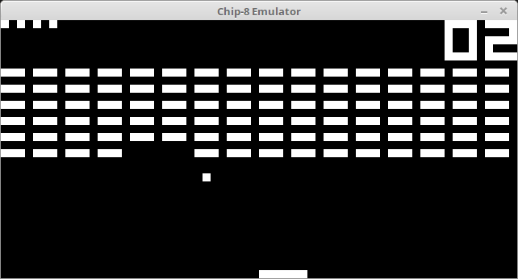
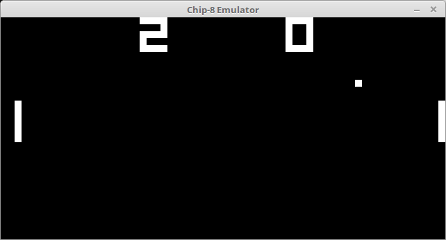
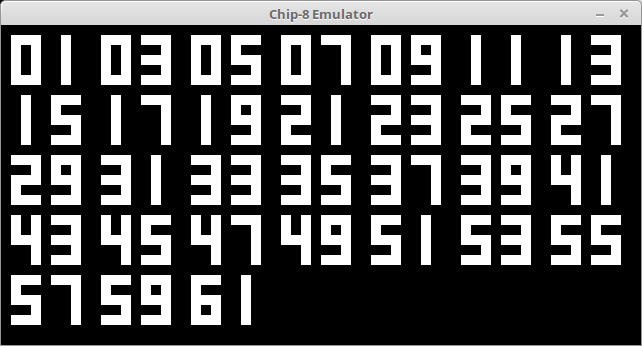
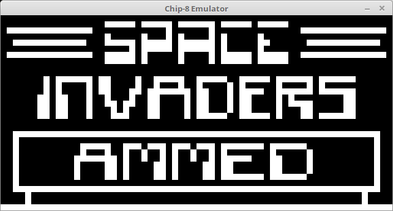

# lazy-chip8

This is my CHIP-8 emulator written in Haskell. Since I've become interested in emulation, I decided a CHIP-8 emulator would be a good starting project. I also used this project to teach myself Haskell, and to get used to a TDD approch to software development.

## Screenshots

  
  
    
  

